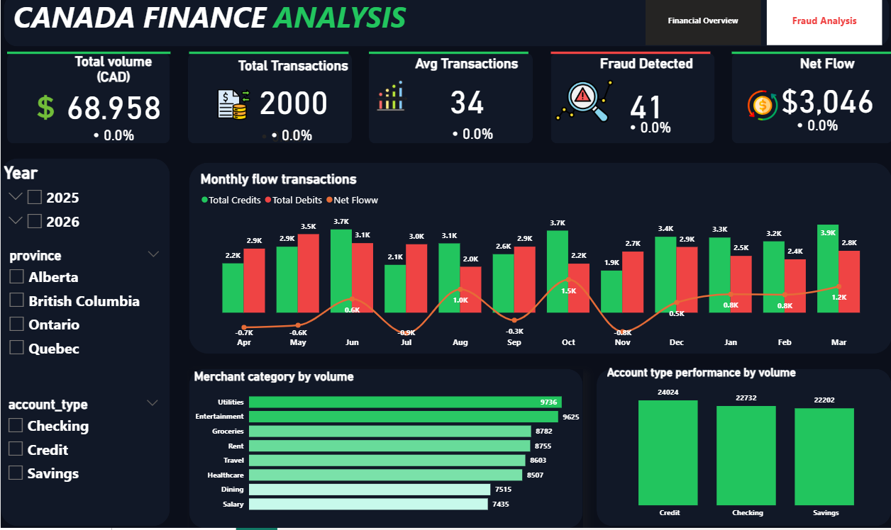
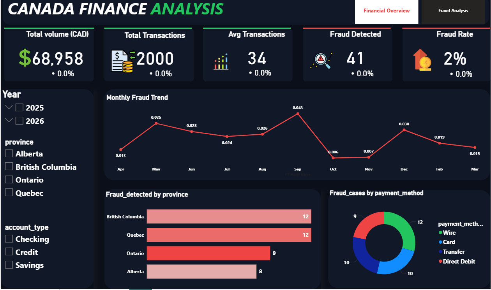

# 📊 Canada Finance Analysis Dashboard

## 📌 Project Overview
This project analyzes financial transactions and fraud patterns using Excel, SQL, and Power BI. The goal is to generate insights into transaction behavior, monitor financial performance, and detect fraud risks.

---

## 📸 Dashboard Preview

### 🔹 Financial Overview

### 🔹 Fraud Analysis

---

## 🎥 Dashboard Demo
[Click here to watch the dashboard video](dashboard-video.mp4)

---

## 📊 Key KPIs

- Total Volume (CAD): $68,958  
- Total Transactions: 2,000  
- Average Transaction: $34  
- Fraud Detected: 41  
- Fraud Rate: 2%  
- Net Flow: $3,046  

---

## 📊 Dashboard Features

### Financial Analysis
- Monthly transaction flow (Credit vs Debit vs Net Flow)  
- Merchant category analysis  
- Account type performance  

### Fraud Analysis
- Monthly fraud trend  
- Fraud by province  
- Fraud cases by payment method  

---

## 🧠 Key Insights

- Increasing transaction activity indicates growth  
- Net flow fluctuations show periods of higher spending  
- Fraud rate (~2%) shows moderate risk  
- Some provinces and payment methods have higher fraud  

---

## 💡 Recommendations

- Strengthen fraud detection for high-risk payments  
- Implement region-based fraud monitoring  
- Improve transaction security (MFA)  
- Monitor negative net flow accounts  

---

## 🛠 Tools Used

- Excel  
- SQL (PostgreSQL)  
- Power BI  

---

## 🚀 Skills Demonstrated

- Data Cleaning  
- SQL Queries  
- DAX Measures  
- Data Visualization  
- Business Analysis
